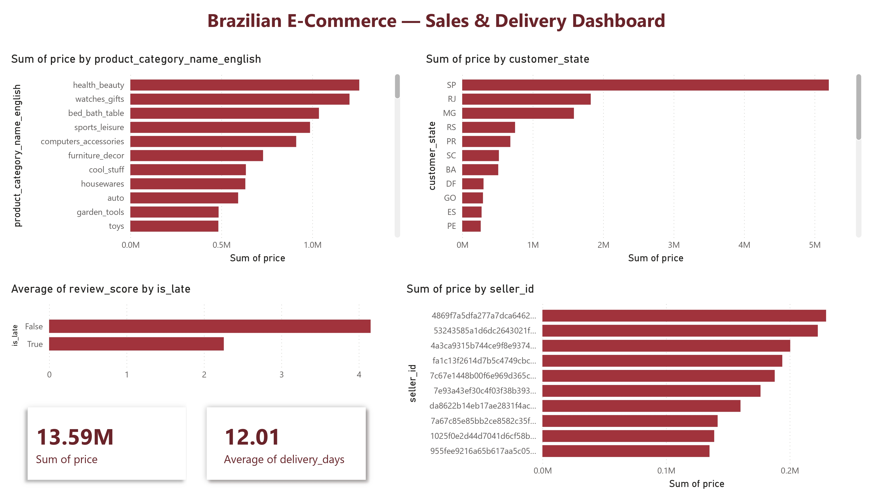

# Brazilian E-Commerce — Sales & Delivery Performance Pipeline
**Personal Portfolio Project**

An end-to-end analytics pipeline on 100K+ Brazilian e-commerce orders — moving raw data through Excel, Python, SQL, and Power BI to answer a real business question.

## Business Question
Which product categories, regions, and sellers drive the most revenue — and where is delivery performance hurting customer satisfaction?

## Pipeline
Excel (profiling) → Python / pandas (cleaning + joining 7 tables) → SQL / SQLite (validation queries) → Power BI (dashboard)

## Tools Used
* **Excel** — initial data profiling
* **Python** (pandas) — cleaning, feature engineering, joining tables
* **SQL** (SQLite) — validation and aggregation queries
* **Power BI** — interactive dashboard

## Dataset
[Brazilian E-Commerce Public Dataset by Olist (Kaggle)](https://www.kaggle.com/datasets/olistbr/brazilian-ecommerce) — 9 tables, 100K+ orders (2016–2018).

## Key Findings
* **Top categories:** Health & Beauty (R$1.26M), Watches & Gifts (R$1.20M), and Bed/Bath/Table (R$1.04M) lead revenue
* **Regional concentration:** São Paulo dominates customers (~42%) and revenue (R$5.2M, nearly 3× the next state); the top 3 states are all in the Southeast
* **Seller concentration:** of 3,095 sellers, the top 10 (0.3%) drive ~13% of revenue
* **Delivery drives satisfaction:** on-time orders average ~4.2★ vs ~2.3★ for late orders — late delivery nearly halves the score, and only ~6% of orders are late

## Recommendation
Delivery reliability is the highest-leverage fix: a small share of late orders does outsized damage to satisfaction. Tightening logistics or setting more realistic delivery estimates would protect reviews and retention.

## Process
Profiled the raw tables in Excel, then in Python cleaned missing values, engineered delivery metrics (is_late, delivery_days), fixed a duplicate-reviews join issue, and joined 7 tables into an analysis-ready dataset. Validated findings in SQL, then visualized in Power BI.

## Deliverables
* `ecommerce__pipeline.xlsx` — Excel profiling workbook
* `ecommerce_pipeline.ipynb` — the full pipeline notebook
* SQL validation queries run in SQLite (shown in the notebook)
* `dashboard_data.csv` — the analysis-ready dataset feeding the dashboard

---
**Author:** Fariba Kazi · [LinkedIn](https://www.linkedin.com/in/fariba-kazi/)
